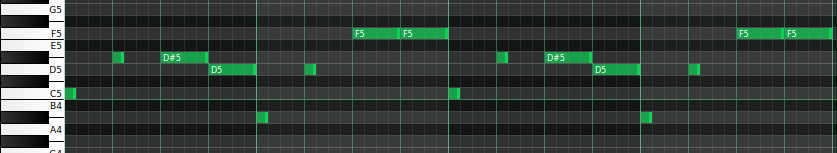

# Synthwave Melody Generator

### Music generation app written on Rust

Application produces MIDI files with the 8 bar lead melody.
User is free to manually choose any key,
scale or mode with an input in the beginning of the program.
BPM is randomly chosen as value in range 90..=120

Results are generated in *./generated* folder. Additional information
(such as key, scale, mode, BPM, melody type) are saved in *./track_settings.txt*
file. Some examples, as well as complete loops (with harmony, drums and arpeggio),
can be found in the source code as *.mid* files

### Generated SMF Melody Example

### Algorithm

First bar is generated with a strict random algorithm: it traverses through all 16
parts of the bar and puts notes or creates the delay. If note’s position % 4 == ’0’, note’s
length can be either 1, 2 or 4; ’1’ - length is 1; ’2’ - length is 1 or 2; otherwise - 1.

Algorithm relates to a chosen melody type (ABAB, AAAB or ABAC). ’A’ is always
generated with the algorithm above. For ABAB, ’B’ is generated as the mutation of ’A’
(some notes may change their pitch). For AAAB, ’B’ is generated with the algorithm above.
For ABAC, ’B’ is new, ’C’ is the mutation of ’A’.

Result is checked with the filters. Finally, all generated 4 bars are duplicated to
generate 8 bar melody and settings file with chosen parameters is generated.

### Report

[Full report](IMG_Team_Project_Report.pdf) and the [presentation](IMG_Team_Project_Presentation.pptx) are available
for the additional details and algorithms that are used to generate other batches